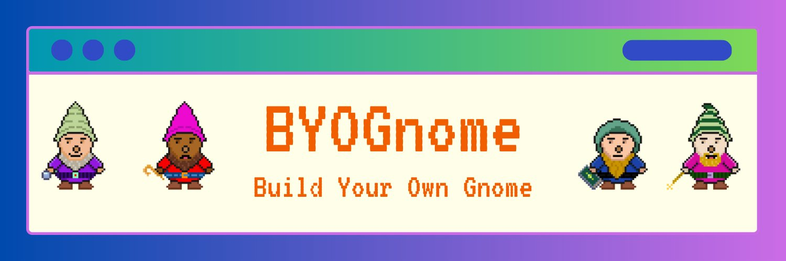

## **ByoMint - a compressed NFT (cNFT) mint program for custom minting and controlled distribution of assets on Solana.**

  
This program leverages **compression on Solana** enabling creators to **mint and distribute cNFTs with minter customization and control**.

**Mainnet Program ID: GnukyHhbXhqeswaZbzDiTLZeMSHMuWNTNxw4buhS6zpg**

# Accounts
**Faucet**

On creation of a `Faucet`, an Collection NFT is minted to the Faucet. Each cNFT emitted will be part of said collection. Faucets have a `supply_cap` that limits the amount of cNFTs that can minted to a collection. The `supply_cap` is the total number of cNFTs that the faucet is able to emit at a given point in time. The `supply_cap` is an mutable property that gives the creator the power to incrementally emit tokens. Faucets have a `mint_price` that is also mutable so that cost of minting a cNFT to the collection can be updated. Once created, new merkle trees can be added to the `Facuet` at any point in time so that collection can continue to grow as needed. 

When creating the `faucet`, the creator must provide a `mint_price` and `seller_fee_basis_points` (royalty percentage). For each cNFT that is minted, the designated `mint_price` is sent the `Faucet` account as payment for the cNFT. This program hard codes a royalty split of 50/50 to the `Faucet` and the wallet that mints the cNFT. If the cNFT is sold on secondary markets, like [tesnor.trade](http://tensor.trade), the designated `seller_fee_basis_points` sent to the `Faucet` and the minter's wallet. Use the instruction `withdraw_fees` as the authority of the `Faucet` to access the funds the faucet generates.

**Metadata Map**

Metadata is assigned to cNFTs after the the token is minted. The map enables projects to customized how many layers (traits) and variants are avaialble. The number of layers is capped at 10, and the cap of variants for each layer is 255.

It is important to note that the JSON metadata file, and image need to be generated using other means that this program. A suggested solution is to use a [Helius Webhook](https://docs.helius.dev/webhooks-and-websockets/what-are-webhooks) to trigger code to run that generates the JSON and image uploads them to [ShdwDrive](https://docs.shdwdrive.com/learn).

**BYO Mint**

This empty account is created during mint using the layers that the minter chooses. This PDA is essential for ensuring that each cNFT minted to the colleciton is unique. 

# Instructions
`create_metadata_map`
`delete_metadata_map`
`create_faucet`
`add_new_tree`
`mint`
`update_faucet`
`withdraw_fees`

# BYOGnomes

I created a project to showcase this program: [BYOGnomes](http://byognome.xyz) 

# TODOs + Project Extensions
- Add WL minting capabilities (token gate holding an NFT, or a wallet list)
- Add customization for royalty splits between minter/faucet
- NFT/SFT/SPL burn in exchange for cNFT
